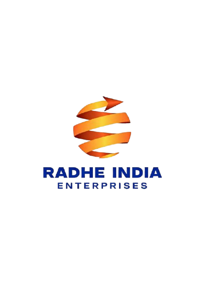

# Radhe India Enterprises — Corporate Website

> **Your Gateway for Global Market**



Official Next.js corporate website for **Radhe India Enterprises**, an Indian international trading and manufacturing enterprise established in 2023 by a visionary woman entrepreneur.

---

## 🌟 Overview

Radhe India Enterprises specializes in connecting Indian producers and manufacturers to international buyers across agriculture, electrical equipment, and industrial supplies. This web application is built for high speed, responsiveness, and zero-latency B2B export inquiry routing directly via WhatsApp and interactive forms.

- **Website**: [https://www.radhe-india.com](https://www.radhe-india.com)
- **Headquarters**: Visakhapatnam, Andhra Pradesh, India (Port City)
- **Distinction**: ISO 9001 Certified • Women Entrepreneur Enterprise

---

## 🚀 Key Features

- **Instant WhatsApp Inquiry Routing**: Form submissions validate input and generate a pre-filled, URL-encoded WhatsApp message to `+91 9494321980`.
- **Streamlined B2B Catalog**: Focuses on core export product verticals:
  - **Agricultural Products**: Rice (Basmati/Non-Basmati), Spices (Turmeric/Chilli/Cumin), Dehydrated Vegetables (Onion/Garlic).
  - **Electrical Products**: Industrial Electrical Equipment, Switchgear Panels & Power Distribution.
  - **Industrial Products**: Stainless Steel Sheets & Coils.
- **Service Capabilities**: Import & Export, Custom Manufacturing, B2B E-Commerce, Electrical Manpower Supply, and Global Supply Chain Management.
- **60 FPS Performance**: GPU hardware-accelerated scrolling, Next.js WebP/AVIF image format optimization, and light JS bundle footprint (~10 kB main page JS).
- **SEO & Vercel Ready**: Full OpenGraph tags, JSON-LD structured data, responsive mobile drawer, and static page pre-rendering.

---

## 🛠️ Tech Stack

- **Framework**: [Next.js 15 (App Router)](https://nextjs.org/)
- **Language**: [TypeScript](https://www.typescriptlang.org/)
- **Styling**: [Tailwind CSS](https://tailwindcss.com/)
- **Animations**: [Framer Motion](https://www.framer.com/motion/)
- **Icons**: [Lucide React](https://lucide.dev/)
- **Deployment**: [Vercel](https://vercel.com/)

---

## 💻 Local Development Setup

### Prerequisites

- Node.js v18.x or v20.x
- npm v9+ or yarn

### Installation

1. Clone the repository:
   ```bash
   git clone https://github.com/beyondwebco-lgtm/radhe-india.git
   cd radhe-india
   ```

2. Install dependencies:
   ```bash
   npm install
   ```

3. Run the development server:
   ```bash
   npm run dev
   ```

4. Open `http://localhost:3000` in your browser.

---

## 🏗️ Production Build

To create an optimized production build for Vercel deployment:

```bash
npm run build
npm run start
```

---

## 📞 Contact Information

- **Email**: info@radhe-india.com
- **Phone / WhatsApp**: +91 9494321980
- **Address**: 2nd Floor, Orange Business Centre, Plot No. 21, Beach Road, Kirlampudi Layout, Visakhapatnam, AP - 530017, India.

---

© 2026 Radhe India Enterprises. All Rights Reserved.
